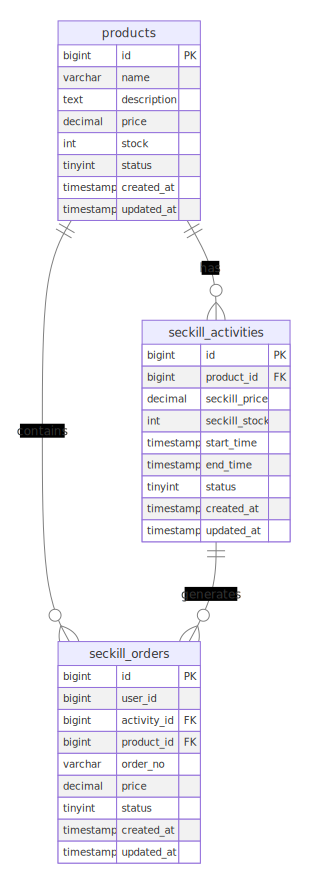

# 数据库

## 数据库表结构
```
-- 创建数据库
CREATE DATABASE IF NOT EXISTS seckill DEFAULT CHARACTER SET utf8mb4 DEFAULT COLLATE utf8mb4_general_ci;
USE seckill;

-- 商品表
CREATE TABLE `products` (
    `id` bigint unsigned NOT NULL AUTO_INCREMENT,
    `name` varchar(255) NOT NULL COMMENT '商品名称',
    `description` text COMMENT '商品描述',
    `price` decimal(10,2) NOT NULL COMMENT '商品价格',
    `stock` int NOT NULL COMMENT '商品库存',
    `status` tinyint NOT NULL DEFAULT '0' COMMENT '商品状态: 0-下架 1-上架',
    `created_at` timestamp NOT NULL DEFAULT CURRENT_TIMESTAMP,
    `updated_at` timestamp NOT NULL DEFAULT CURRENT_TIMESTAMP ON UPDATE CURRENT_TIMESTAMP,
    PRIMARY KEY (`id`),
    KEY `idx_status` (`status`)
) ENGINE=InnoDB DEFAULT CHARSET=utf8mb4 COMMENT='商品表';

-- 秒杀活动表
CREATE TABLE `seckill_activities` (
    `id` bigint unsigned NOT NULL AUTO_INCREMENT,
    `product_id` bigint unsigned NOT NULL COMMENT '商品ID',
    `seckill_price` decimal(10,2) NOT NULL COMMENT '秒杀价格',
    `seckill_stock` int NOT NULL COMMENT '秒杀库存',
    `start_time` timestamp NOT NULL COMMENT '开始时间',
    `end_time` timestamp NOT NULL COMMENT '结束时间',
    `status` tinyint NOT NULL DEFAULT '0' COMMENT '活动状态: 0-未开始 1-进行中 2-已结束',
    `created_at` timestamp NOT NULL DEFAULT CURRENT_TIMESTAMP,
    `updated_at` timestamp NOT NULL DEFAULT CURRENT_TIMESTAMP ON UPDATE CURRENT_TIMESTAMP,
    PRIMARY KEY (`id`),
    KEY `idx_product_id` (`product_id`),
    KEY `idx_status` (`status`)
) ENGINE=InnoDB DEFAULT CHARSET=utf8mb4 COMMENT='秒杀活动表';

-- 秒杀订单表
CREATE TABLE `seckill_orders` (
    `id` bigint unsigned NOT NULL AUTO_INCREMENT,
    `user_id` bigint unsigned NOT NULL COMMENT '用户ID',
    `activity_id` bigint unsigned NOT NULL COMMENT '活动ID',
    `product_id` bigint unsigned NOT NULL COMMENT '商品ID',
    `order_no` varchar(64) NOT NULL COMMENT '订单号',
    `price` decimal(10,2) NOT NULL COMMENT '购买价格',
    `status` tinyint NOT NULL DEFAULT '0' COMMENT '订单状态: 0-未支付 1-已支付 2-已取消',
    `created_at` timestamp NOT NULL DEFAULT CURRENT_TIMESTAMP,
    `updated_at` timestamp NOT NULL DEFAULT CURRENT_TIMESTAMP ON UPDATE CURRENT_TIMESTAMP,
    PRIMARY KEY (`id`),
    UNIQUE KEY `uk_order_no` (`order_no`),
    KEY `idx_user_id` (`user_id`),
    KEY `idx_activity_id` (`activity_id`)
) ENGINE=InnoDB DEFAULT CHARSET=utf8mb4 COMMENT='秒杀订单表';
```

## Go结构体模型
```
// internal/model/product.go
package model

import (
    "time"
)

type Product struct {
    ID          uint      `gorm:"primarykey" json:"id"`
    Name        string    `json:"name"`
    Description string    `json:"description"`
    Price       float64   `json:"price"`
    Stock       int       `json:"stock"`
    Status      int8      `json:"status"`
    CreatedAt   time.Time `json:"created_at"`
    UpdatedAt   time.Time `json:"updated_at"`
}

type SeckillActivity struct {
    ID           uint      `gorm:"primarykey" json:"id"`
    ProductID    uint      `json:"product_id"`
    SeckillPrice float64   `json:"seckill_price"`
    SeckillStock int       `json:"seckill_stock"`
    StartTime    time.Time `json:"start_time"`
    EndTime      time.Time `json:"end_time"`
    Status       int8      `json:"status"`
    CreatedAt    time.Time `json:"created_at"`
    UpdatedAt    time.Time `json:"updated_at"`
}

type SeckillOrder struct {
    ID         uint      `gorm:"primarykey" json:"id"`
    UserID     uint      `json:"user_id"`
    ActivityID uint      `json:"activity_id"`
    ProductID  uint      `json:"product_id"`
    OrderNo    string    `json:"order_no"`
    Price      float64   `json:"price"`
    Status     int8      `json:"status"`
    CreatedAt  time.Time `json:"created_at"`
    UpdatedAt  time.Time `json:"updated_at"`
}
```

## 数据库连接
```
// internal/dao/mysql.go
package dao

import (
    "fmt"
    "log"

    "github.com/spf13/viper"
    "gorm.io/driver/mysql"
    "gorm.io/gorm"
    "gorm.io/gorm/logger"
)

var DB *gorm.DB

func InitMySQL() {
    dsn := fmt.Sprintf("%s:%s@tcp(%s:%s)/%s?charset=%s&parseTime=True&loc=Local",
        viper.GetString("mysql.username"),
        viper.GetString("mysql.password"),
        viper.GetString("mysql.host"),
        viper.GetString("mysql.port"),
        viper.GetString("mysql.database"),
        viper.GetString("mysql.charset"),
    )

    var err error
    DB, err = gorm.Open(mysql.Open(dsn), &gorm.Config{
        Logger: logger.Default.LogMode(logger.Info),
    })
    if err != nil {
        log.Fatalf("Failed to connect to database: %v", err)
    }

    // 获取通用数据库对象 sql.DB，然后使用其提供的功能
    sqlDB, err := DB.DB()
    if err != nil {
        log.Fatalf("Failed to get database instance: %v", err)
    }

    // SetMaxIdleConns 设置空闲连接池中连接的最大数量
    sqlDB.SetMaxIdleConns(10)
    // SetMaxOpenConns 设置打开数据库连接的最大数量
    sqlDB.SetMaxOpenConns(100)
}
```


## 更新`main.go`
```
package main

import (
    "log"
    "seckill-system/internal/dao"

    "github.com/gin-gonic/gin"
    "github.com/spf13/viper"
)

func init() {
    // 加载配置文件
    viper.SetConfigName("config")
    viper.SetConfigType("yaml")
    viper.AddConfigPath("./configs")
    
    if err := viper.ReadInConfig(); err != nil {
        log.Fatalf("Error reading config file: %s", err)
    }

    // 初始化数据库连接
    dao.InitMySQL()
}

func main() {
    // 创建gin实例
    r := gin.Default()

    // 注册路由
    initRouter(r)

    // 启动服务器
    port := viper.GetString("server.port")
    if err := r.Run(":" + port); err != nil {
        log.Fatalf("Server startup failed: %s", err)
    }
}

func initRouter(r *gin.Engine) {
    // 健康检查
    r.GET("/ping", func(c *gin.Context) {
        c.JSON(200, gin.H{
            "message": "pong",
        })
    })

    // TODO: 添加商品管理和秒杀相关路由
}
```


### 测试数据库是否成功连接
0. 创建一个正式的handler文件`// internal/handler/db.go`
```
// internal/handler/db.go
package handler

import (
	"net/http"
	"seckill-system/internal/dao"

	"github.com/gin-gonic/gin"
)

func TestDB(c *gin.Context) {
	sqlDB, err := dao.DB.DB()
	if err != nil {
		c.JSON(http.StatusInternalServerError, gin.H{
			"message": "获取数据库实例失败",
			"error":   err.Error(),
		})
		return
	}

	// 测试数据库连接
	err = sqlDB.Ping()
	if err != nil {
		c.JSON(http.StatusInternalServerError, gin.H{
			"message": "数据库连接失败",
			"error":   err.Error(),
		})
		return
	}

	// 获取数据库统计信息
	stats := sqlDB.Stats()

	c.JSON(http.StatusOK, gin.H{
		"message": "数据库连接成功",
		"stats": gin.H{
			"max_open_connections": stats.MaxOpenConnections,
			"open_connections":     stats.OpenConnections,
			"in_use":               stats.InUse,
			"idle":                 stats.Idle,
		},
	})
}

```

1. 创建一个测试路由 `// internal/handler/db_test.go`
```
// internal/handler/db_test.go
package handler_test

import (
	"net/http"
	"net/http/httptest"
	"testing"

	"seckill-system/internal/handler"

	"github.com/gin-gonic/gin"
)

func TestDBConnection(t *testing.T) {
	// 设置测试模式
	gin.SetMode(gin.TestMode)

	// 创建测试路由
	r := gin.New()
	r.GET("/test/db", handler.TestDB)

	// 创建测试请求
	w := httptest.NewRecorder()
	req, _ := http.NewRequest("GET", "/test/db", nil)

	// 执行请求
	r.ServeHTTP(w, req)

	// 检查响应状态码
	if w.Code != http.StatusOK {
		t.Errorf("期望状态码 %d, 得到 %d", http.StatusOK, w.Code)
	}
}

```

2. 在`main.go`里添加这个测试路由
```
package main

import (
	"log"
	"seckill-system/internal/dao"
	"seckill-system/internal/handler"

	"github.com/gin-gonic/gin"
	"github.com/spf13/viper"
)

func init() {
	// 加载配置文件
	viper.SetConfigName("config")
	viper.SetConfigType("yaml")
	viper.AddConfigPath("./configs")
	
	if err := viper.ReadInConfig(); err != nil {
		log.Fatalf("Error reading config file: %s", err)
	}

	// 初始化数据库连接
	dao.InitMySQL()
}

func main() {
	// 创建gin实例
	r := gin.Default()

	// 注册路由
	initRouter(r)

	// 启动服务器
	port := viper.GetString("server.port")
	if err := r.Run(":" + port); err != nil {
		log.Fatalf("Server startup failed: %s", err)
	}
}

func initRouter(r *gin.Engine) {
	// 健康检查
	r.GET("/ping", func(c *gin.Context) {
		c.JSON(200, gin.H{
			"message": "pong",
		})
	})

	// 数据库连接测试
	r.GET("/test/db", handler.TestDB)
}
```
3. 创建测试文件[`// test/db_test.go`](../test/db_test.go)
4. 启动服务器并且测试API, 记得不要忘记修改configs/config.yaml的数据库密码. 
```
# 启动服务器
go run main.go

# 使用curl测试连接
curl http://localhost:8080/test/db

# 单元测试, 在项目根目录下运行
go test -v ./test/...
```
