# 商品管理的CRUD接口

## 服务层代码`// internal/service/product.go`
```
// internal/service/product.go
package service

import (
	"errors"
	"seckill-system/internal/dao"
	"seckill-system/internal/model"
)

type ProductService struct{}

func NewProductService() *ProductService {
	return &ProductService{}
}

// CreateProduct 创建商品
func (s *ProductService) CreateProduct(product *model.Product) error {
	return dao.DB.Create(product).Error
}

// GetProduct 获取商品详情
func (s *ProductService) GetProduct(id uint) (*model.Product, error) {
	var product model.Product
	if err := dao.DB.First(&product, id).Error; err != nil {
		return nil, err
	}
	return &product, nil
}

// UpdateProduct 更新商品信息
func (s *ProductService) UpdateProduct(product *model.Product) error {
	if product.ID == 0 {
		return errors.New("product id is required")
	}

	// 只更新特定字段
	return dao.DB.Model(product).Updates(map[string]interface{}{
		"name":        product.Name,
		"description": product.Description,
		"price":       product.Price,
		"stock":       product.Stock,
		"status":      product.Status,
	}).Error
}

// DeleteProduct 删除商品
func (s *ProductService) DeleteProduct(id uint) error {
	return dao.DB.Delete(&model.Product{}, id).Error
}

// ListProducts 获取商品列表
func (s *ProductService) ListProducts(page, pageSize int) ([]model.Product, int64, error) {
	var products []model.Product
	var total int64

	// 获取总数
	if err := dao.DB.Model(&model.Product{}).Count(&total).Error; err != nil {
		return nil, 0, err
	}

	// 获取分页数据
	offset := (page - 1) * pageSize
	if err := dao.DB.Offset(offset).Limit(pageSize).Find(&products).Error; err != nil {
		return nil, 0, err
	}

	return products, total, nil
}
```

## 控制器层代码`// internal/handler/product.go`
```
// internal/handler/product.go
package handler

import (
    "net/http"
    "strconv"
    "seckill-system/internal/model"
    "seckill-system/internal/service"

    "github.com/gin-gonic/gin"
)

type ProductHandler struct {
    productService *service.ProductService
}

func NewProductHandler() *ProductHandler {
    return &ProductHandler{
        productService: service.NewProductService(),
    }
}

// Create 创建商品
func (h *ProductHandler) Create(c *gin.Context) {
    var product model.Product
    if err := c.ShouldBindJSON(&product); err != nil {
        c.JSON(http.StatusBadRequest, gin.H{"error": err.Error()})
        return
    }

    if err := h.productService.CreateProduct(&product); err != nil {
        c.JSON(http.StatusInternalServerError, gin.H{"error": err.Error()})
        return
    }

    c.JSON(http.StatusOK, gin.H{
        "message": "商品创建成功",
        "data":    product,
    })
}

// Get 获取商品详情
func (h *ProductHandler) Get(c *gin.Context) {
    idStr := c.Param("id")
    id, err := strconv.ParseUint(idStr, 10, 64)
    if err != nil {
        c.JSON(http.StatusBadRequest, gin.H{"error": "无效的商品ID"})
        return
    }

    product, err := h.productService.GetProduct(uint(id))
    if err != nil {
        c.JSON(http.StatusInternalServerError, gin.H{"error": err.Error()})
        return
    }

    c.JSON(http.StatusOK, gin.H{
        "data": product,
    })
}

// Update 更新商品
func (h *ProductHandler) Update(c *gin.Context) {
    var product model.Product
    if err := c.ShouldBindJSON(&product); err != nil {
        c.JSON(http.StatusBadRequest, gin.H{"error": err.Error()})
        return
    }

    if err := h.productService.UpdateProduct(&product); err != nil {
        c.JSON(http.StatusInternalServerError, gin.H{"error": err.Error()})
        return
    }

    c.JSON(http.StatusOK, gin.H{
        "message": "商品更新成功",
        "data":    product,
    })
}

// Delete 删除商品
func (h *ProductHandler) Delete(c *gin.Context) {
    idStr := c.Param("id")
    id, err := strconv.ParseUint(idStr, 10, 64)
    if err != nil {
        c.JSON(http.StatusBadRequest, gin.H{"error": "无效的商品ID"})
        return
    }

    if err := h.productService.DeleteProduct(uint(id)); err != nil {
        c.JSON(http.StatusInternalServerError, gin.H{"error": err.Error()})
        return
    }

    c.JSON(http.StatusOK, gin.H{
        "message": "商品删除成功",
    })
}

// List 获取商品列表
func (h *ProductHandler) List(c *gin.Context) {
    // 获取分页参数
    pageStr := c.DefaultQuery("page", "1")
    pageSizeStr := c.DefaultQuery("page_size", "10")

    page, err := strconv.Atoi(pageStr)
    if err != nil || page < 1 {
        page = 1
    }

    pageSize, err := strconv.Atoi(pageSizeStr)
    if err != nil || pageSize < 1 {
        pageSize = 10
    }

    products, total, err := h.productService.ListProducts(page, pageSize)
    if err != nil {
        c.JSON(http.StatusInternalServerError, gin.H{"error": err.Error()})
        return
    }

    c.JSON(http.StatusOK, gin.H{
        "data": gin.H{
            "list":      products,
            "total":     total,
            "page":      page,
            "page_size": pageSize,
        },
    })
}
```


## 测试命令
1. 创建商品
```
curl -X POST http://localhost:8080/api/v1/products \
  -H "Content-Type: application/json" \
  -d '{"name":"测试商品","description":"这是一个测试商品","price":99.99,"stock":100,"status":1}'
```
2. 获取商品详情
```
curl http://localhost:8080/api/v1/products/1
```
3. 更新商品
```
curl -X PUT http://localhost:8080/api/v1/products \
  -H "Content-Type: application/json" \
  -d '{"id":1,"name":"更新后的商品","price":88.88,"stock":200,"status":1}'
```
4. 删除商品
```
curl -X DELETE http://localhost:8080/api/v1/products/1
```
5. 获取商品列表
```
curl "http://localhost:8080/api/v1/products?page=1&page_size=10"
```