# 秒杀活动管理

## 秒杀活动服务层`// internal/service/seckill.go`
```
// internal/service/seckill.go
package service

import (
    "errors"
    "time"
    "seckill-system/internal/dao"
    "seckill-system/internal/model"
)

type SeckillActivityService struct{}

func NewSeckillActivityService() *SeckillActivityService {
    return &SeckillActivityService{}
}

// CreateActivity 创建秒杀活动
func (s *SeckillActivityService) CreateActivity(activity *model.SeckillActivity) error {
    // 验证商品是否存在
    var product model.Product
    if err := dao.DB.First(&product, activity.ProductID).Error; err != nil {
        return errors.New("商品不存在")
    }

    // 验证时间是否合法
    if activity.StartTime.After(activity.EndTime) {
        return errors.New("结束时间不能早于开始时间")
    }

    // 验证库存是否充足
    if activity.SeckillStock > product.Stock {
        return errors.New("秒杀库存不能大于商品库存")
    }

    // 检查是否存在时间冲突的活动
    var count int64
    err := dao.DB.Model(&model.SeckillActivity{}).
        Where("product_id = ? AND status != 2 AND ((start_time <= ? AND end_time >= ?) OR (start_time <= ? AND end_time >= ?))",
            activity.ProductID, activity.StartTime, activity.StartTime, activity.EndTime, activity.EndTime).
        Count(&count).Error
    
    if err != nil {
        return err
    }
    if count > 0 {
        return errors.New("该商品在此时间段已存在秒杀活动")
    }

    return dao.DB.Create(activity).Error
}

// GetActivity 获取秒杀活动详情
func (s *SeckillActivityService) GetActivity(id uint) (*model.SeckillActivity, error) {
    var activity model.SeckillActivity
    if err := dao.DB.First(&activity, id).Error; err != nil {
        return nil, err
    }
    return &activity, nil
}

// UpdateActivity 更新秒杀活动
func (s *SeckillActivityService) UpdateActivity(activity *model.SeckillActivity) error {
    if activity.ID == 0 {
        return errors.New("活动ID不能为空")
    }

    // 查询原有活动
    var oldActivity model.SeckillActivity
    if err := dao.DB.First(&oldActivity, activity.ID).Error; err != nil {
        return errors.New("活动不存在")
    }

    // 如果活动已经开始，则不允许修改
    if oldActivity.Status == 1 {
        return errors.New("活动已开始，不能修改")
    }

    return dao.DB.Save(activity).Error
}

// ListActivities 获取活动列表
func (s *SeckillActivityService) ListActivities(page, pageSize int, status int8) ([]model.SeckillActivity, int64, error) {
    var activities []model.SeckillActivity
    var total int64
    
    query := dao.DB.Model(&model.SeckillActivity{})
    if status != -1 {
        query = query.Where("status = ?", status)
    }

    // 获取总数
    if err := query.Count(&total).Error; err != nil {
        return nil, 0, err
    }

    // 获取分页数据
    offset := (page - 1) * pageSize
    if err := query.Offset(offset).Limit(pageSize).Find(&activities).Error; err != nil {
        return nil, 0, err
    }

    return activities, total, nil
}

// UpdateActivityStatus 更新活动状态
func (s *SeckillActivityService) UpdateActivityStatus() error {
    now := time.Now()
    
    // 更新已开始的活动
    err := dao.DB.Model(&model.SeckillActivity{}).
        Where("status = 0 AND start_time <= ?", now).
        Update("status", 1).Error
    if err != nil {
        return err
    }

    // 更新已结束的活动
    return dao.DB.Model(&model.SeckillActivity{}).
        Where("status = 1 AND end_time <= ?", now).
        Update("status", 2).Error
}
```

## 秒杀活动控制器层
```
// internal/handler/seckill.go
package handler

import (
    "net/http"
    "strconv"
    "seckill-system/internal/model"
    "seckill-system/internal/service"

    "github.com/gin-gonic/gin"
)

type SeckillActivityHandler struct {
    seckillService *service.SeckillActivityService
}

func NewSeckillActivityHandler() *SeckillActivityHandler {
    return &SeckillActivityHandler{
        seckillService: service.NewSeckillActivityService(),
    }
}

// Create 创建秒杀活动
func (h *SeckillActivityHandler) Create(c *gin.Context) {
    var activity model.SeckillActivity
    if err := c.ShouldBindJSON(&activity); err != nil {
        c.JSON(http.StatusBadRequest, gin.H{"error": err.Error()})
        return
    }

    if err := h.seckillService.CreateActivity(&activity); err != nil {
        c.JSON(http.StatusInternalServerError, gin.H{"error": err.Error()})
        return
    }

    c.JSON(http.StatusOK, gin.H{
        "message": "秒杀活动创建成功",
        "data":    activity,
    })
}

// Get 获取秒杀活动详情
func (h *SeckillActivityHandler) Get(c *gin.Context) {
    idStr := c.Param("id")
    id, err := strconv.ParseUint(idStr, 10, 64)
    if err != nil {
        c.JSON(http.StatusBadRequest, gin.H{"error": "无效的活动ID"})
        return
    }

    activity, err := h.seckillService.GetActivity(uint(id))
    if err != nil {
        c.JSON(http.StatusInternalServerError, gin.H{"error": err.Error()})
        return
    }

    c.JSON(http.StatusOK, gin.H{
        "data": activity,
    })
}

// Update 更新秒杀活动
func (h *SeckillActivityHandler) Update(c *gin.Context) {
    var activity model.SeckillActivity
    if err := c.ShouldBindJSON(&activity); err != nil {
        c.JSON(http.StatusBadRequest, gin.H{"error": err.Error()})
        return
    }

    if err := h.seckillService.UpdateActivity(&activity); err != nil {
        c.JSON(http.StatusInternalServerError, gin.H{"error": err.Error()})
        return
    }

    c.JSON(http.StatusOK, gin.H{
        "message": "秒杀活动更新成功",
        "data":    activity,
    })
}

// List 获取秒杀活动列表
func (h *SeckillActivityHandler) List(c *gin.Context) {
    pageStr := c.DefaultQuery("page", "1")
    pageSizeStr := c.DefaultQuery("page_size", "10")
    statusStr := c.DefaultQuery("status", "-1")

    page, err := strconv.Atoi(pageStr)
    if err != nil || page < 1 {
        page = 1
    }

    pageSize, err := strconv.Atoi(pageSizeStr)
    if err != nil || pageSize < 1 {
        pageSize = 10
    }

    status, err := strconv.Atoi(statusStr)
    if err != nil {
        status = -1
    }

    activities, total, err := h.seckillService.ListActivities(page, pageSize, int8(status))
    if err != nil {
        c.JSON(http.StatusInternalServerError, gin.H{"error": err.Error()})
        return
    }

    c.JSON(http.StatusOK, gin.H{
        "data": gin.H{
            "list":      activities,
            "total":     total,
            "page":      page,
            "page_size": pageSize,
        },
    })
}
```

## 更新`main.go`路由配置
```
func initRouter(r *gin.Engine) {
    // ... 之前的路由配置 ...

    // 秒杀活动路由
    seckillHandler := handler.NewSeckillActivityHandler()
    v1 := r.Group("/api/v1")
    {
        seckill := v1.Group("/seckill")
        {
            seckill.POST("/activities", seckillHandler.Create)       // 创建秒杀活动
            seckill.GET("/activities/:id", seckillHandler.Get)       // 获取秒杀活动详情
            seckill.PUT("/activities", seckillHandler.Update)        // 更新秒杀活动
            seckill.GET("/activities", seckillHandler.List)          // 获取秒杀活动列表
        }
    }
}
```


## 测试
1. 创建秒杀活动
```
curl -X POST http://localhost:8080/api/v1/seckill/activities \
  -H "Content-Type: application/json" \
  -d '{
    "product_id": 1,
    "seckill_price": 49.99,
    "seckill_stock": 50,
    "start_time": "2024-12-16T10:00:00Z",
    "end_time": "2024-12-16T12:00:00Z",
    "status": 0
  }'
```
2. 获取活动详情
```
curl http://localhost:8080/api/v1/seckill/activities/1
```

3. 更新活动
```
curl -X PUT http://localhost:8080/api/v1/seckill/activities \
  -H "Content-Type: application/json" \
  -d '{
    "id": 1,
    "seckill_price": 39.99,
    "seckill_stock": 100
  }'
```

4. 获取活动列表
```
# 获取所有活动
curl "http://localhost:8080/api/v1/seckill/activities?page=1&page_size=10"

# 获取指定状态的活动（0-未开始，1-进行中，2-已结束）
curl "http://localhost:8080/api/v1/seckill/activities?status=1"
```