# 秒杀核心逻辑

## Redis初始化
1. 在`main.go`中添加
```
dao.InitRedis() //dao.InitMySQL()的后面就可以
```

2. 创建`// internal/dao/redis.go`
```
// internal/dao/redis.go
package dao

import (
    "context"
    "fmt"
    "github.com/go-redis/redis/v8"
    "github.com/spf13/viper"
)

var RDB *redis.Client

func InitRedis() {
    RDB = redis.NewClient(&redis.Options{
        Addr:     fmt.Sprintf("%s:%s", viper.GetString("redis.host"), viper.GetString("redis.port")),
        Password: viper.GetString("redis.password"),
        DB:       viper.GetInt("redis.db"),
    })

    // 测试连接
    ctx := context.Background()
    if err := RDB.Ping(ctx).Err(); err != nil {
        panic(fmt.Sprintf("Redis连接失败: %v", err))
    }
}
```

## 秒杀核心服务`// internal/service/seckill_core.go`
```
// internal/service/seckill_core.go
package service

import (
	"context"
	"errors"
	"fmt"
	"seckill-system/internal/dao"
	"seckill-system/internal/model"
	"sync"
	"time"

	"github.com/go-redis/redis/v8"
	"gorm.io/gorm"
)

const (
	// Redis key 前缀
	ActivityStockKey = "seckill:stock:%d"   // 活动库存
	UserOrderKey     = "seckill:user:%d:%d" // 用户秒杀记录
)

type SeckillCoreService struct {
	mutex sync.Mutex
}

func NewSeckillCoreService() *SeckillCoreService {
	return &SeckillCoreService{}
}

// PreloadStock 预热库存到Redis
func (s *SeckillCoreService) PreloadStock(activityID uint, stock int) error {
	ctx := context.Background()
	key := fmt.Sprintf(ActivityStockKey, activityID)

	// 使用Redis事务保证原子性
	_, err := dao.RDB.TxPipelined(ctx, func(pipe redis.Pipeliner) error {
		// 删除旧的库存记录
		pipe.Del(ctx, key)
		// 设置新的库存
		pipe.Set(ctx, key, stock, 24*time.Hour)
		return nil
	})

	return err
}

// Seckill 执行秒杀
func (s *SeckillCoreService) Seckill(userID, activityID uint) error {
	ctx := context.Background()

	// 1. 检查活动是否存在且在进行中
	activity, err := s.checkActivityStatus(activityID)
	if err != nil {
		return err
	}

	// 2. 检查用户是否已经秒杀过
	userOrderKey := fmt.Sprintf(UserOrderKey, activityID, userID)
	if exists, _ := dao.RDB.Exists(ctx, userOrderKey).Result(); exists == 1 {
		return errors.New("您已经参与过此次秒杀")
	}

	// 3. 扣减Redis库存
	stockKey := fmt.Sprintf(ActivityStockKey, activityID)
	stock, err := dao.RDB.Decr(ctx, stockKey).Result()
	if err != nil {
		return err
	}
	if stock < 0 {
		// 恢复库存
		dao.RDB.Incr(ctx, stockKey)
		return errors.New("商品已售罄")
	}

	// 4. 创建订单（使用数据库事务）
	err = dao.DB.Transaction(func(tx *gorm.DB) error {
		// 4.1 再次检查库存，使用 FOR UPDATE 锁
		var dbActivity model.SeckillActivity
		if err := tx.Set("gorm:query_option", "FOR UPDATE").First(&dbActivity, activityID).Error; err != nil {
			return err
		}
		if dbActivity.SeckillStock <= 0 {
			return errors.New("商品已售罄")
		}

		// 4.2 扣减数据库库存
		if err := tx.Model(&dbActivity).Update("seckill_stock", gorm.Expr("seckill_stock - ?", 1)).Error; err != nil {
			return err
		}

		// 4.3 创建订单
		order := model.SeckillOrder{
			UserID:     userID,
			ActivityID: activityID,
			ProductID:  activity.ProductID,
			OrderNo:    generateOrderNo(userID),
			Price:      activity.SeckillPrice,
			Status:     0, // 未支付
		}
		if err := tx.Create(&order).Error; err != nil {
			return err
		}

		return nil
	})

	if err != nil {
		// 回滚Redis库存
		dao.RDB.Incr(ctx, stockKey)
		return err
	}

	// 5. 记录用户秒杀记录
	dao.RDB.Set(ctx, userOrderKey, 1, 24*time.Hour)

	return nil
}

// checkActivityStatus 检查活动状态
func (s *SeckillCoreService) checkActivityStatus(activityID uint) (*model.SeckillActivity, error) {
	var activity model.SeckillActivity
	now := time.Now()

	err := dao.DB.Where("id = ? AND status = 1 AND start_time <= ? AND end_time >= ?",
		activityID, now, now).First(&activity).Error
	if err != nil {
		if err == gorm.ErrRecordNotFound {
			return nil, errors.New("活动不存在或未在进行中")
		}
		return nil, err
	}

	return &activity, nil
}

// generateOrderNo 生成订单号
func generateOrderNo(userID uint) string {
	// 简单的订单号生成规则：时间戳+用户ID+随机数
	timestamp := time.Now().Format("20060102150405")
	return fmt.Sprintf("%s%d%03d", timestamp, userID, time.Now().UnixNano()%1000)
}
```


## 更新`main.go`路由配置
```
// 秒杀核心接口
seckillCoreHandler := handler.NewSeckillCoreHandler()
v1 := r.Group("/api/v1")
{
    seckill := v1.Group("/seckill")
    {
        // ... 之前的秒杀活动管理接口 ...
        
        // 秒杀核心接口
        seckill.POST("/do/:id", seckillCoreHandler.Seckill)           // 执行秒杀
        seckill.POST("/preload/:id", seckillCoreHandler.PreloadStock) // 库存预热
    }
}
```


## 测试
1. 预热库存
```
curl -X POST "http://localhost:8080/api/v1/seckill/preload/1?stock=100"
```
2. 执行秒杀
```
curl -X POST http://localhost:8080/api/v1/seckill/do/1
```